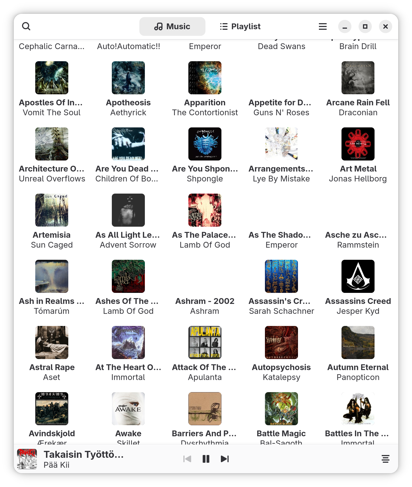

## JellyTune, Gnome audio player for Jellyfin

My idea is to have native Gnome client for Jellyfin that is also fully supported for mobile devices. So simple audio player. That means no massive edit functionality and no video playback. My wish is to use this on my mobile Linux device at some point.

For now, it only supports one audio and playlist collection. That is the way I use Jellyfin. If you are using some other way, then leave a comment through support ticket and I see what we can do about it.

Oh, and the whole reason for this all is that I like to buy records and have them locally. I don't use streaming services for music :)

## Requirements
JellyTune for Gnome requires at least Gnome 45 (libAdwaita 1.6 or later). x86_64 and aarch64 versions are both also supported.

## Packages
There will be couple of ways to get JellyTune. Downloading appimage or flatpak from releases. Flathub install coming at some point

## Project
Project is written in C#. It is separated in multiple projects:
**JellyTune.Shared**: Can be used for shared functionality if there will be similar player for example KDE.
**JellyTune.Test**: Unit tests for shared project
**JellyTune.Gnome**: Gnome client

## Thanks
My thanks for the people who have and are working with these:
[Gir.Core](https://github.com/gircore/gir.core),
[SoundFlow](https://github.com/LSXPrime/SoundFlow),
[Jellyfin](https://jellyfin.org) and
[Tmds.DBus](https://github.com/tmds/Tmds.DBus)
 
Also special thanks to Ruut Kiiskilä for providing the logo to JellyTune. Nice job!

Last mention to [Jetbrains](https://www.jetbrains.com/) for providing open source licenses of their products. Thank you.

## Planned versions:

**1.0**
- Startup wizard for basic configuration
- Basic functionality for playing audio
- Support for single playlist
- Gnome integration

**1.1**
- Bug fixes
- Added extended controls (seek/volume)

**1.1.1**
- Bug fixes
- Updates on startup wizard

**1.2**
- Support for keyring(?)
- Last.fm support (?)
- Feel free to suggest features
